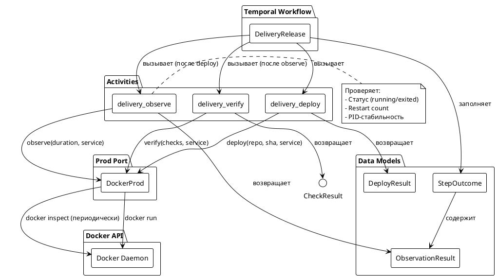
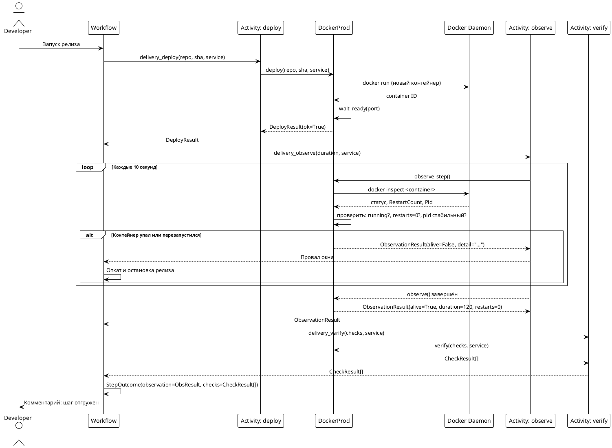
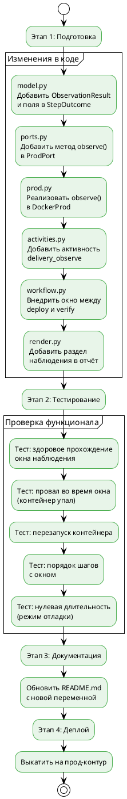

# FNR-1: Системные требования — Окно наблюдения после выкатки

## 1. Введение

### 1.1 Метаданные

| Поле | Значение |
|------|----------|
| **Номер требования** | FNR-1 |
| **Название** | Окно наблюдения после выкатки |
| **Статус** | Черновик |
| **Версия** | 1.0 |
| **Автор** | System Analyst |
| **Дата создания** | 2026-08-25 |
| **Ответственный за реализацию** | Backend Developer |
| **Приоритет** | P3 |

### 1.2 Термины и определения

| Термин | Определение |
|--------|-------------|
| **Окно наблюдения** | Период времени после выкатки контейнера на прод-контур, в течение которого проверяется его стабильность |
| **Docker health-check** | Механизм проверки состояния контейнера через Docker API (`docker inspect`) |
| **PID-стабильность** | Сохранение идентификатора процесса контейнера между проверками (отсутствие рестарта) |
| **Restart count** | Количество перезапусков контейнера (счётчик в Docker) |
| **Наблюдение** | Отдельный шаг воркфлоу, проверяющий состояние контейнера в течение заданного периода |
| **Прод-контур** | Контейнер на том же хосте, что и воркер, поднятый из состояния базовой ветки |

### 1.3 Ссылки на связанные документы

| Документ | Описание |
|----------|----------|
| [task.md](./task.md) | Постановка проблемы |
| [concept.md](./concept.md) | Концепты решений и вердикт дебатов |
| `poh_delivery/workflow.py:2054-2077` | Место внедрения окна наблюдения |
| `poh_delivery/model.py:962-970` | Модель StepOutcome |
| `poh_delivery/prod.py:1186-1239` | Прод-контур и выкатка |
| `poh_delivery/ports.py:1058-1064` | Протокол ProdPort |

### 1.4 История изменений

| Версия | Дата | Автор | Изменение |
|--------|------|-------|-----------|
| 1.0 | 2026-08-25 | System Analyst | Первая версия системных требований |

---

## 2. Общее описание

### 2.1 Текущее состояние (As-Is)

#### Описание текущего поведения

Шаг релиза считается успешным сразу после прохождения проверок (`delivery_verify`) в `workflow.py:2060-2064`. Если проверки зелёные, шаг помечается как выполненный (`workflow.py:2067-2077`), даже если сервис упадёт через несколько секунд после этого.

**Код-доказательство (workflow.py:2054-2077):**

```python
deployed: DeployResult = await workflow.execute_activity(
    "delivery_deploy", args=[repo, merged_sha, bundle.service],
    result_type=DeployResult,
    start_to_close_timeout=timedelta(minutes=15), retry_policy=_WRITE)

checks = []
if deployed.ok:
    checks = await workflow.execute_activity(
        "delivery_verify", args=[bundle.checks, bundle.service],
        result_type=List[CheckResult],
        start_to_close_timeout=timedelta(minutes=10), retry_policy=_READ)

failed = [c for c in checks if not c.ok]
if deployed.ok and not failed:
    outcomes.append(StepOutcome(
        pr_number=step.pr_number, ok=True, merged_sha=merged_sha,
        deployed=True, checks=checks,
        detail=deployed.detail))
```

**Проблема:** Между `deploy` (строка 2054) и `verify` (строка 2061) нет окна наблюдения. Проверки запускаются сразу после выкатки, и сервис прожил даже 1 секунду считается достаточным.

#### Ключевые компоненты текущего решения

| Компонент | Роль | Код-локация |
|-----------|-----|-------------|
| **Workflow** | Воркфлоу релиза | `poh_delivery/workflow.py:2054-2077` |
| **StepOutcome** | Модель результата шага | `poh_delivery/model.py:962-970` |
| **DockerProd** | Прод-контур (Docker) | `poh_delivery/prod.py:1186-1239` |
| **ProdPort** | Протокол прод-контура | `poh_delivery/ports.py:1058-1064` |
| **Activities** | Активности воркфлоу | `poh_delivery/activities.py:215-225` |
| **Render** | Отчёты релиза | `poh_delivery/render.py:1487-1496` |

#### Ограничения текущего решения

1. **Отсутствие окна наблюдения** — проверки запускаются сразу после выкатки
2. **Нет проверки состояния контейнера** — статус, перезапуски, PID-стабильность не проверяются
3. **Ложнопозитивная оценка** — сервис, падающий через минуту, получает статус "зелёный"
4. **Нет диагностики провала** — не фиксируется время и причина падения

### 2.2 Архитектурное решение

Выбранный концепт: **Концепт 1 — Правильное: Полноценное окно наблюдения с Docker health-check**

#### Суть решения

Внедрить окно наблюдения как отдельный шаг воркфлоу с периодической проверкой состояния контейнера через Docker API. Контейнер проверяется на:
- Статус (`running` vs `exited`)
- Restart count (через `docker inspect`)
- PID-стабильность (одинаков ли PID контейнера между проверками)

Финальные проверки запускаются только после успешного прохождения окна.

#### Порядок взаимодействия компонентов

```
Workflow → Activity Observe → DockerProd.observe() → Docker API
                ↓                      ↓
          Temporal History     ObservationResult
                ↓                      ↓
           StepOutcome          Render Report
```

### 2.3 Диаграмма компонентов



### 2.4 Схема последовательности



---

## 3. План миграции

### 3.1 Стратегия внедрения

Внедрение производится в один этап, так как изменения не затрагивают существующее поведение при нулевой длительности окна.

### 3.2 Диаграмма этапов внедрения



### 3.3 Таблица этапов внедрения

| Этап | Описание | Критерий готовности | Откат |
|------|----------|---------------------|-------|
| **1. Подготовка** | Изменения в 7 файлах (model, ports, prod, activities, workflow, render, tests) | Все файлы изменены, код компилируется | `git checkout -- .` |
| **2. Тестирование** | Запуск тестов, проверка сценариев | Все тесты проходят, новые тесты покрывают случаи | Откат изменений в тестах |
| **3. Документация** | Обновление README.md с новой переменной `DELIVERY_OBSERVE_SECONDS` | Документация обновлена | Откат документации |
| **4. Деплой** | Выкатка на прод-контур | Агент запущен, переменная настроена | Откат к предыдущей версии агента |

### 3.4 Критерии готовности к внедрению

1. Все модифицированные файлы прошли ревью
2. Все тесты (существующие + новые) проходят
3. Документация обновлена
4. Переменная окружения `DELIVERY_OBSERVE_SECONDS` задокументирована
5. План отката утверждён

---

## 4. Функциональные требования — Backend / БД / API

### 4.1 Изменения в модели данных

**ID:** SR-001
**Название:** Добавить модель ObservationResult

| Метаданные | Значение |
|------------|----------|
| Ответственный за тех. реализацию | Backend Developer |
| Задача на разработку | FNR-1/SR-001 |
| Jira-ссылка | (будет создана) |
| Статус | К реализации |

#### Описание

Добавить новый dataclass `ObservationResult` в `model.py` для хранения результатов наблюдения за контейнером.

#### Обоснование

Текущая модель `StepOutcome` не содержит полей для хранения результатов наблюдения. Новый dataclass позволит фиксировать длительность окна, статус контейнера и причину провала.

#### Затрагиваемые компоненты

- `poh_delivery/model.py`

#### Критерии приёмки

1. `ObservationResult` добавлен в `model.py`
2. Поля соответствуют спецификации:
   - `duration: int` — длительность окна в секундах
   - `alive: bool` — контейнер жив всё окно
   - `restarts: int` — количество перезапусков
   - `detail: str` — деталь провала (если не alive)
3. Dataclass импортируется в `__init__.py`

#### Зависимости

Нет

---

**ID:** SR-002
**Название:** Добавить поля наблюдения в StepOutcome

| Метаданные | Значение |
|------------|----------|
| Ответственный за тех. реализацию | Backend Developer |
| Задача на разработку | FNR-1/SR-002 |
| Jira-ссылка | (будет создана) |
| Статус | К реализации |

#### Описание

Добавить поле `observation: ObservationResult | None` в dataclass `StepOutcome` для хранения результатов наблюдения.

#### Обоснование

Текущая модель `StepOutcome` (строки 962-970) не содержит информации о наблюдении. Новое поле позволит хранить результаты окна наблюдения для каждого шага.

#### Код-доказательство (model.py:962-970):

```python
@dataclass
class StepOutcome:
    pr_number: int
    ok: bool = False
    merged_sha: str = ""
    deployed: bool = False
    checks: list[CheckResult] = field(default_factory=list)
    rolled_back: bool = False
    detail: str = ""
```

#### Затрагиваемые компоненты

- `poh_delivery/model.py`

#### Критерии приёмки

1. Поле `observation` добавлено в `StepOutcome`
2. Поле опциональное (`| None`)
3. Сериализация в Temporal работает корректно
4. Обратная совместимость: старые экземпляры без поля обрабатываются корректно

#### Зависимости

- SR-001 (ObservationResult должен быть создан)

---

### 4.2 Изменения в протоколе прод-контура

**ID:** SR-003
**Название:** Добавить метод observe() в ProdPort

| Метаданные | Значение |
|------------|----------|
| Ответственный за тех. реализацию | Backend Developer |
| Задача на разработку | FNR-1/SR-003 |
| Jira-ссылка | (будет создана) |
| Статус | К реализации |

#### Описание

Добавить метод `def observe(self, duration: int, service: dict) -> ObservationResult` в протокол `ProdPort`.

#### Обоснование

Текущий протокол `ProdPort` (строки 1058-1064) содержит только методы `deploy()`, `verify()` и `current_sha()`. Необходим новый метод для наблюдения за состоянием контейнера.

#### Код-доказательство (ports.py:1058-1064):

```python
class ProdPort(Protocol):
    """Прод-контур: куда уезжает влитое и чем проверяется, что оно живо."""

    def deploy(self, repo: str, sha: str, service: dict) -> DeployResult: ...
    def verify(self, checks: list[CheckSpec], service: dict) -> list[CheckResult]: ...
    def current_sha(self) -> str: ...
```

#### Затрагиваемые компоненты

- `poh_delivery/ports.py`

#### Критерии приёмки

1. Метод `observe()` добавлен в `ProdPort`
2. Сигнатура соответствует спецификации:
   - `duration: int` — длительность окна в секундах
   - `service: dict` — конфигурация сервиса (порт, health_path)
   - Возвращает `ObservationResult`
3. Метод typings-корректный (без `...` после реализации)

#### Зависимости

- SR-001 (ObservationResult должен быть создан)

---

### 4.3 Реализация наблюдения в прод-контуре

**ID:** SR-004
**Название:** Реализовать observe() в DockerProd

| Метаданные | Значение |
|------------|----------|
| Ответственный за тех. реализацию | Backend Developer |
| Задача на разработку | FNR-1/SR-004 |
| Jira-ссылка | (будет создана) |
| Статус | К реализации |

#### Описание

Реализовать метод `observe()` в классе `DockerProd` (`prod.py`). Метод должен периодически проверять состояние контейнера через Docker API.

#### Обоснование

Текущая реализация `DockerProd` (строки 1147-1283) содержит методы `deploy()` и `verify()`, но не содержит метода наблюдения. Необходимо добавить проверку состояния контейнера в течение заданного периода.

#### Код-доказательство (prod.py:1147-1220):

```python
class DockerProd:
    """Прод-контур как контейнер, поднятый из клона репозитория на общем томе."""

    def __init__(self, token_provider, dry_run: bool = False):
        self._token_for = token_provider
        self._dry_run = dry_run

    def deploy(self, repo: str, sha: str, service: dict) -> DeployResult:
        # ... реализация выкатки
```

#### Затрагиваемые компоненты

- `poh_delivery/prod.py`

#### Критерии приёмки

1. Метод `observe()` реализован в `DockerProd`
2. Проверка выполняется каждые 10 секунд (настраиваемо)
3. Проверяются:
   - Статус контейнера (`running` vs `exited`)
   - Restart count (через `docker inspect`)
   - PID-стабильность
4. При обнаружении провала наблюдение прерывается
5. Возвращается `ObservationResult` с корректными полями

#### Нефункциональные требования

- **Периодичность проверки:** 10 секунд (настраивается через `DELIVERY_OBSERVE_CHECK_INTERVAL`)
- **Таймаут Docker inspect:** 5 секунд
- **Максимальная длительность окна:** 900 секунд (ограничивается в воркфлоу)

#### Зависимости

- SR-001 (ObservationResult должен быть создан)
- SR-003 (Метод в ProdPort должен быть объявлен)

---

### 4.4 Активность наблюдения

**ID:** SR-005
**Название:** Добавить активность delivery_observe

| Метаданные | Значение |
|------------|----------|
| Ответственный за тех. реализацию | Backend Developer |
| Задача на разработку | FNR-1/SR-005 |
| Jira-ссылка | (будет создана) |
| Статус | К реализации |

#### Описание

Добавить активность `@activity.defn(name="delivery_observe")` в `activities.py`. Активность должна вызывать `ports.prod().observe()`.

#### Обоснование

Текущий список активностей `ALL` (строки 263-278) не содержит активности наблюдения. Необходима отдельная активность для истории Temporal и изоляции логики.

#### Код-доказательство (activities.py:263-278):

```python
ALL = [
    collect_state,
    pull_facts,
    read_checks,
    existing_tags,
    create_release,
    update_release,
    comment,
    merge,
    deploy,
    verify,
    revert,
    prod_sha,
    memory_rules,
    capture_episode,
]
```

#### Затрагиваемые компоненты

- `poh_delivery/activities.py`

#### Критерии приёмки

1. Активность `delivery_observe` добавлена
2. Декоратор `@activity.defn(name="delivery_observe")` применён
3. Активность принимает `duration: int` и `service: dict`
4. Активность вызывает `ports.prod().observe(duration, service)`
5. Активность добавлена в список `ALL`

#### Зависимости

- SR-001 (ObservationResult должен быть создан)
- SR-004 (Метод observe() должен быть реализован)

---

### 4.5 Внедрение окна в воркфлоу

**ID:** SR-006
**Название:** Внедрить окно наблюдения в workflow

| Метаданные | Значение |
|------------|----------|
| Ответственный за тех. реализацию | Backend Developer |
| Задача на разработку | FNR-1/SR-006 |
| Jira-ссылка | (будет создана) |
| Статус | К реализации |

#### Описание

Внедрить окно наблюдения между `deploy` и `verify` в воркфлоу (`workflow.py:2054-2077`). Добавить чтение переменной окружения `DELIVERY_OBSERVE_SECONDS`.

#### Обоснование

Текущий порядок (deploy → verify) не содержит окна наблюдения. Необходимо добавить шаг observe между ними, после которого финальные проверки запускаются только при успешном наблюдении.

#### Код-доказательство (workflow.py:2054-2077):

```python
deployed: DeployResult = await workflow.execute_activity(
    "delivery_deploy", args=[repo, merged_sha, bundle.service],
    result_type=DeployResult,
    start_to_close_timeout=timedelta(minutes=15), retry_policy=_WRITE)

checks = []
if deployed.ok:
    checks = await workflow.execute_activity(
        "delivery_verify", args=[bundle.checks, bundle.service],
        result_type=List[CheckResult],
        start_to_close_timeout=timedelta(minutes=10), retry_policy=_READ)
```

#### Затрагиваемые компоненты

- `poh_delivery/workflow.py`

#### Критерии приёмки

1. Переменная `DELIVERY_OBSERVE_SECONDS` читается из окружения (умолчание 120)
2. Длительность ограничивается потолком 900 секунд
3. Между `deploy` и `verify` добавлен вызов `delivery_observe`
4. При нулевой длительности окно пропускается (режим отладки)
5. При провале окна выполняется откат (существующая логика)
6. `StepOutcome` заполняется результатом наблюдения

#### Нефункциональные требования

- **Переменная окружения:** `DELIVERY_OBSERVE_SECONDS` (умолчание 120, максимум 900)
- **Переменная окружения:** `DELIVERY_OBSERVE_CHECK_INTERVAL` (умолчание 10 секунд)
- **Таймаут активности:** `duration + 60` секунд

#### Зависимости

- SR-001 (ObservationResult должен быть создан)
- SR-002 (Поля в StepOutcome должны быть добавлены)
- SR-005 (Активность delivery_observe должна быть создана)

---

### 4.6 Отображение наблюдения в отчётах

**ID:** SR-007
**Название:** Добавить раздел наблюдения в отчёт релиза

| Метаданные | Значение |
|------------|----------|
| Ответственный за тех. реализацию | Backend Developer |
| Задача на разработку | FNR-1/SR-007 |
| Jira-ссылка | (будет создана) |
| Статус | К реализации |

#### Описание

Добавить раздел "Наблюдение после выкатки" в метод `report_md()` класса `render.py`. Раздел должен отображать результаты наблюдения для каждого шага.

#### Обоснование

Текущий отчёт (`render.py:1487-1496`) содержит раздел "Проверки по шагам", но не содержит информации о наблюдении. Необходимо добавить блок с результатами окна наблюдения.

#### Код-доказательство (render.py:1487-1496):

```python
if any(o.checks for o in outcomes):
    out.append("### Проверки по шагам")
    out.append("")
    out.append("| PR | Проверка | Итог |")
    out.append("|----|----------|------|")
    for outcome in outcomes:
        for check in outcome.checks:
            mark = "зелёная" if check.ok else f"**красная** — {check.detail}"
            out.append(f"| #{outcome.pr_number} | `{check.name}` | {mark} |")
    out.append("")
```

#### Затрагиваемые компоненты

- `poh_delivery/render.py`

#### Критерии приёмки

1. Раздел "Наблюдение после выкатки" добавлен в `report_md()`
2. Для каждого шага с `observation` отображается:
   - Длительность окна
   - Статус (прожил / упал)
   - Количество перезапусков
   - Деталь провала (если есть)
3. При нулевой длительности отображается "Окно наблюдения отключено"
4. При отсутствии `observation` (старые релизы) раздел не отображается

#### Зависимости

- SR-001 (ObservationResult должен быть создан)
- SR-002 (Поля в StepOutcome должны быть добавлены)

---

### 4.7 Тесты

**ID:** SR-008
**Название:** Добавить тесты для окна наблюдения

| Метаданные | Значение |
|------------|----------|
| Ответственный за тех. реализацию | Backend Developer |
| Задача на разработку | FNR-1/SR-008 |
| Jira-ссылка | (будет создана) |
| Статус | К реализации |

#### Описание

Добавить тесты в `tests/test_workflow.py` для проверки функционала окна наблюдения.

#### Обоснование

Текущие тесты (`test_workflow.py:209`) проверяют порядок шагов без окна наблюдения. Необходимо добавить тесты для новых сценариев.

#### Код-доказательство (tests/test_workflow.py:209):

```python
assert window[:4] == ["merge:5", "checks:merged5", "deploy:merged5", "verify"]
```

#### Затрагиваемые компоненты

- `tests/test_workflow.py`
- `tests/test_prod.py` (дополнительно)

#### Критерии приёмки

1. Тест порядка шагов включает `observe` между `deploy` и `verify`
2. Тест здорового прохождения окна:
   - Контейнер жив всё окно
   - `ObservationResult(alive=True, restarts=0)`
3. Тест провала окна:
   - Контейнер упал во время окна
   - Шаг красный, откат выполнен
4. Тест перезапуска контейнера:
   - Restart count > 0
   - Шаг красный
5. Тест нулевой длительности:
   - Окно пропускается
   - Порядок шагов как раньше

#### Зависимости

- SR-001 - SR-007 (Все компоненты должны быть реализованы)

---

## 5. Требования к интерфейсам — Frontend / UI

**Не применимо** — Документ не содержит UI-изменений. Все изменения касаются серверной логики (воркфлоу, прод-контур, активности, рендеринг отчётов).

---

## 6. Ревью требований

| Роль | Имя | Дата | Комментарии |
|------|-----|------|-------------|
| **Аналитик** | System Analyst | 2026-08-25 | Первичная версия |
| **Разработчик Backend** | (ожидается) | - | Требуется ревью |
| **Разработчик Frontend** | (не применимо) | - | - |
| **Тестирование** | (ожидается) | - | Требуется ревью |

---

## 7. Риски и ограничения

### 7.1 Таблица рисков

| ID | Риск | Вероятность | Влияние | Митигация |
|----|------|-------------|---------|-----------|
| **R1** | Увеличение времени релиза на 120 секунд на каждый шаг | Средняя | Средняя | Настраиваемая длительность, ноль = отключение |
| **R2** | Docker API может не отдавать restart count без дополнительных вызовов | Средняя | Низкая | Fallback на проверку статуса и PID |
| **R3** | Ложные срабатывания при сетевых задержках Docker | Низкая | Низкая | Retry-логика в observe(), таймаут 5s |
| **R4** | Увеличение нагрузки на Docker демон при частых проверках | Низкая | Низкая | Периодичность 10s, настраивается |
| **R5** | Контейнер может отвечать 200, но быть в процессе краша (OOM) | Низкая | Средняя | Проверка restart count и PID |

### 7.2 Ограничения

1. **Ограничение длительности:** Максимум 900 секунд (15 минут) на окно наблюдения
2. **Периодичность проверки:** Минимум 5 секунд между проверками
3. **Отсутствие метрик/Sentry:** Решение основано только на Docker API
4. **Отсутствие отдельного поведения для отката:** Используется существующий механизм
5. **Ограничение контура:** Решение работает только с Docker-контуром
6. **Нет проверки внутри контейнера:** Проверяется только внешний статус, не логи процесса

---

## 8. Приложения

### 8.1 Пример ObservationResult

```python
@dataclass
class ObservationResult:
    duration: int      # 120 — окно 120 секунд
    alive: bool        # True — контейнер жил всё окно
    restarts: int      # 0 — не перезапускался
    detail: str        # "контейнер жив" или "контейнер остановился на секунде 45"
```

### 8.2 Переменные окружения

| Переменная | Умолчание | Описание |
|------------|-----------|----------|
| `DELIVERY_OBSERVE_SECONDS` | 120 | Длительность окна наблюдения в секундах (0 = отключить) |
| `DELIVERY_OBSERVE_CHECK_INTERVAL` | 10 | Интервал между проверками в секундах |

### 8.3 Порядок шагов после внедрения

```
До: merge → checks → deploy → verify → (rollback если провал)
После: merge → checks → deploy → observe → verify → (rollback если провал)
```

### 8.4 SQL-скрипты

**Не применимо** — Изменения не затрагивают базу данных.

---

*Документ создан: 2026-08-25*
*Следующий шаг: `/validate-doc sa_documentation/FNR/FNR_1/system_requirements.md`*
