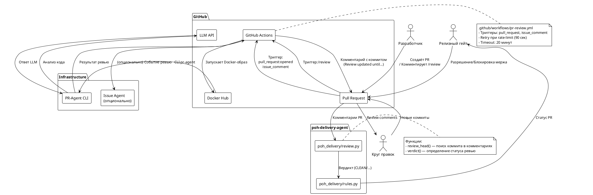
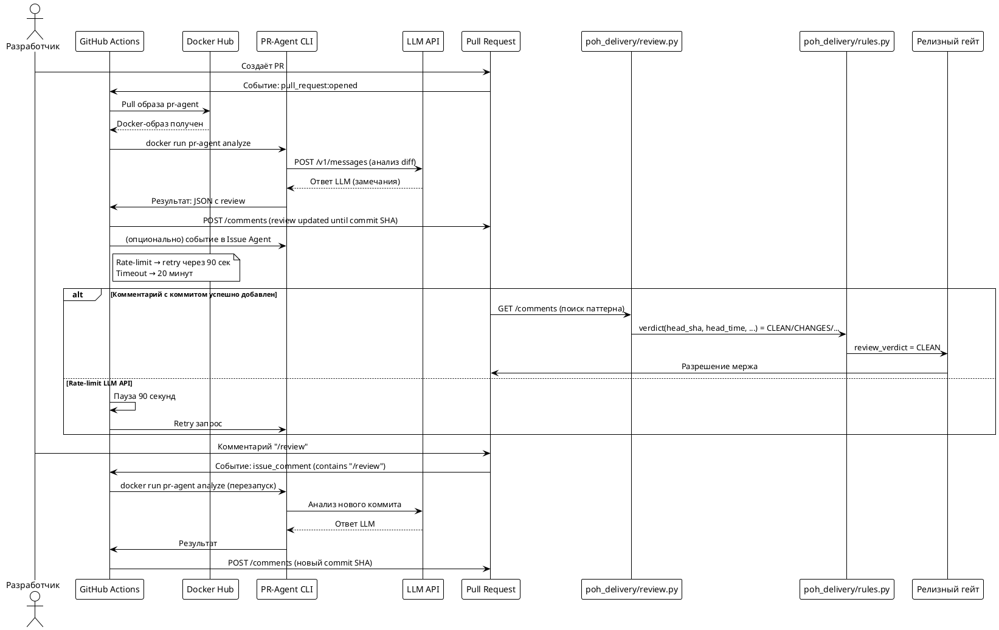
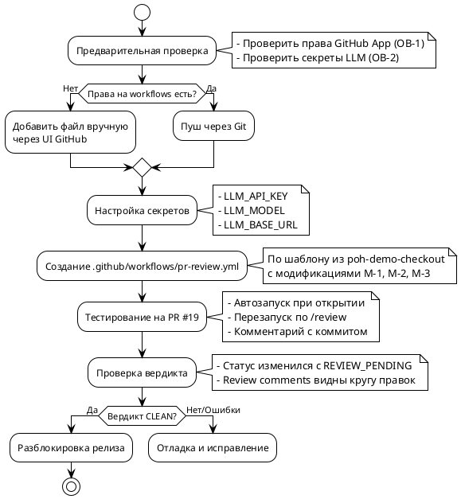

# Системные требования FNR-1: Внедрить механизм ревью PR

## 1. Введение

### 1.1 Метаданные

| Поле | Значение |
|------|----------|
| **Документ** | Системные требования |
| **Задача** | FNR-1: Внедрить механизм ревью PR |
| **Версия** | 1.0 |
| **Статус** | Черновик |
| **Дата создания** | 2026-08-25 |
| **Ответственный аналитик** | SA-helper |
| **Ответственный за тех. реализацию** | Backend-разработчик |
| **Связанные PR** | #19 |
| **Связанные Issue** | #20 |

### 1.2 Термины и определения

| Термин | Определение |
|--------|-------------|
| **PR-Agent** | CLI-инструмент для автоматического код-ревью Pull Request |
| **Вердикт ревью** | Статус проверки кода: `CLEAN`, `CHANGES`, `BLOCKED`, `STALE`, `NONE` |
| **GitHub Actions workflow** | Файл YAML в `.github/workflows/`, описывающий автоматизацию |
| **Круг правок** | Агент, который исправляет замечания ревью |
| **Релизный гейт** | Проверка, определяющая готовность PR к релизу |
| **Review comment** | Формальное замечание ревью (построчный комментарий) |
| **Docker Hub** | Реестр Docker-образов для pr-agent |

### 1.3 Ссылки

| Артефакт | Ссылка |
|----------|--------|
| [Концепт решения](sa_documentation/FNR/FNR_1/concept.md) | [ссылка] |
| [Постановка задачи](sa_documentation/FNR/FNR_1/task.md) | [ссылка] |
| [Демо-воркфлоу pr-review.yml](https://raw.githubusercontent.com/po-helper-org/poh-demo-checkout/main/.github/workflows/pr-review.yml) | [ссылка] |
| [PR #19](https://github.com/po-helper-org/poh-delivery-agent/pull/19) | [ссылка] |
| [Issue #20](https://github.com/po-helper-org/poh-delivery-agent/issues/20) | [ссылка] |

### 1.4 История изменений

| Дата | Версия | Изменение | Автор |
|------|--------|----------|-------|
| 2026-08-25 | 1.0 | Initial | SA-helper |

---

## 2. Общее описание

### 2.1 As-Is: Текущее состояние

#### 2.1.1 Ключевые компоненты

**Функция вердикта ревью (`poh_delivery/review.py`)**

```python
# poh_delivery/review.py:1537-1642
# Функция verdict() возвращает:
# - CLEAN: ревью пройдено, замечаний нет
# - CHANGES: ревьюер требует правок
# - BLOCKED: круг правок сдался
# - STALE: вердикт устарел (коммит изменился)
# - NONE: ревью не проводилось (проблема!)
```

**Классификация вердикта (`poh_delivery/rules.py`)**

```python
# poh_delivery/rules.py:1734-1736
if pr.review_verdict in (review.STALE, review.NONE):
    return Verdict(pr.number, REVIEW_PENDING,
                   pr.review_reason or "нет вердикта ревью на текущий коммит")
```

**Текущие workflows (`.github/workflows/`)**

В репозитории существует только `tests.yml` для запуска pytest. Workflow для ревью **отсутствует**.

```yaml
# .github/workflows/tests.yml:1-17
name: tests
on:
  pull_request:
  push:
    branches: [main]
jobs:
  pytest:
    # ... запуск тестов
```

#### 2.1.2 Ограничения текущего решения

1. **Отсутствует автоматический запуск ревью** — PR-Agent не вызывается при открытии PR
2. **Команда `/review` ни к чему не привязана** — нет триггера для перезапуска
3. **Вердикт всегда `NONE`** — `review_head()` возвращает пустую строку
4. **Статус блокируется** — `REVIEW_PENDING` не даёт слить PR навсегда

### 2.2 Архитектурное решение

**Выбранный концепт:** Концепт A (Правильное) — Полноценный GitHub Actions workflow

**Модификации из дебатов:**

| ID | Модификация | Описание |
|----|-------------|----------|
| М-1 | Проверка секретов | Явная проверка наличия LLM credentials при запуске |
| М-2 | Опциональная интеграция | Issue Agent интеграция сделана опциональной |
| М-3 | Fallback Docker Hub | Резервный способ запуска при недоступности Docker Hub |
| М-4 | Документация | Инструкция по настройке прав и секретов |

### 2.3 Диаграмма компонентов



### 2.4 Схема последовательности



---

## 3. План миграции

### 3.1 Этапы внедрения



### 3.2 Таблица этапов

| Этап | Описание | Действия | Критерий готовности | Откат |
|------|----------|----------|---------------------|-------|
| **0. Предусловия** | Проверка прав и секретов | - Проверить права GitHub App на workflows<br>- Проверить наличие секретов LLM | - Права есть или файл будет добавлен вручную<br>- Секреты известны или будут добавлены | При отсутствии прав — добавить файл через UI GitHub |
| **1. Настройка секретов** | Добавление LLM credentials в GitHub Secrets | - `LLM_API_KEY`<br>- `LLM_MODEL`<br>- `LLM_BASE_URL` (опционально) | Секреты доступны в workflow settings | Удалить секреты из GitHub Settings |
| **2. Создание workflow** | Добавление файла `.github/workflows/pr-review.yml` | - Скопировать шаблон из демо<br>- Применить модификации М-1, М-2, М-3<br>- Закоммитить и запушить | Файл виден в `.github/workflows/` | Удалить файл из ветки |
| **3. Тестирование** | Проверка на тестовом PR | - Открыть тестовый PR или использовать #19<br>- Проверить автозапуск<br>- Проверить команду `/review` | - Workflow появился в Actions<br>- Комментарий с коммитом добавлен<br>- Вердинкт изменился | Закрыть тестовый PR, удалить workflow |
| **4. Верификация** | Проверка интеграции с релизным гейтом | - Проверить статус `REVIEW_PENDING` → `CLEAN`<br>- Проверить видимость review comments | - Гейт не блокирует PR<br>- Круг правок видит замечания | Откатить workflow, вернуться к этапу 2 |
| **5. Документация** | Обновление документации (М-4) | - Добавить инструкцию в README.md<br>- Добавить в CONTRIBUITING.md | Инструкция доступна в репозитории | Удалить добавленные разделы |

### 3.3 Критерии готовности к внедрению

| ID | Критерий | Проверка |
|----|----------|----------|
| КГ-1 | Права GitHub App на workflows проверены | ОВ-1 выполнен |
| КГ-2 | Секреты LLM настроены | ОВ-2 выполнен |
| КГ-3 | Workflow файл создан и закоммичен | `.github/workflows/pr-review.yml` существует |
| КГ-4 | Тестовый PR прошёл ревью | Комментарий с коммитом появился |
| КГ-5 | Вердинкт изменился | Статус больше не `REVIEW_PENDING` |
| КГ-6 | Review comments видны | Круг правок видит замечания |

---

## 4. Функциональные требования — Backend / БД / API

**Примечание:** В рамках данной задачи изменения в БД не требуются. Все требования относятся к GitHub Actions workflow и интеграции с существующим кодом.

### 4.1 Создание workflow для автоматического ревью PR

| Метаданные | Значение |
|-----------|----------|
| **Ответственный за тех. реализацию** | Backend-разработчик / DevOps |
| **Задача на разработку** | [JIRA-link] (Статус: Backlog) |

#### 4.1.1 Описание

Создать файл `.github/workflows/pr-review.yml` для автоматического запуска PR-Agent при открытии или обновлении Pull Request. Workflow должен:

1. Запускаться по триггерам:
   - `pull_request:opened` — при открытии PR
   - `issue_comment` — при комментарии `/review`
   - `pull_request:synchronize` — при новых коммитах (опционально)

2. Использовать CLI-образ pr-agent через Docker

3. Оставлять комментарий с текстом `review updated until commit <SHA>`

4. Обрабатывать rate-limit с паузой 90 секунд

5. Иметь timeout 20 минут

#### 4.1.2 Обоснование

**Бизнес-причина:** Текущий релизный гейт блокирует PR из-за отсутствия вердикта ревью (`REVIEW_PENDING` → `NONE`). Автоматический запуск ревью разблокирует релизы.

**Техническая причина:** Модули `poh_delivery/review.py` и `poh_delivery/rules.py` уже готовы работать с вердиктом. Нужно только обеспечить появление комментариев PR-Agent.

#### 4.1.3 Затрагиваемые компоненты

| Компонент | Тип изменений | Описание |
|-----------|---------------|----------|
| `.github/workflows/` | Новый файл | `pr-review.yml` |
| GitHub Settings | Конфигурация | Секреты `LLM_API_KEY`, `LLM_MODEL`, `LLM_BASE_URL` |
| GitHub App Permissions | Проверка | Право `workflows` |

#### 4.1.4 Критерии приёмки

| ID | Критерий | Проверка |
|----|----------|----------|
| КП-1 | Файл `.github/workflows/pr-review.yml` создан | `git ls-files .github/workflows/pr-review.yml` |
| КП-2 | Workflow запускается при открытии PR | В Actions виден запуск на событии `pull_request:opened` |
| КП-3 | Workflow перезапускается по `/review` | Комментарий `/review` триггерит workflow |
| КП-4 | Комментарий с коммитом появляется | В PR есть комментарий `review updated until commit ...` |
| КП-5 | Timeout = 20 минут | В workflow задан `timeout-minutes: 20` |
| КП-6 | Retry при rate-limit | При 429 ответе пауза 90 секунд |

#### 4.1.5 Зависимости

- Зависит от: КГ-1, КГ-2 (предусловия — права и секреты)
- Блокирует: 4.2

#### 4.1.6 Нефункциональные требования

| ID | Требование | Значение / Порог |
|----|------------|-------------------|
| НФР-1 | Время выполнения | ≤ 20 минут (timeout) |
| НФР-2 | Повтор при ошибке | 1 попытка с паузой 90 секунд |
| НФР-3 | Доступность Docker Hub | Fallback на альтернативный registry (М-3) |

---

### 4.2 Интеграция с Issue Agent (опционально)

| Метаданные | Значение |
|-----------|----------|
| **Ответственный за тех. реализацию** | Backend-разработчик |
| **Задача на разработку** | [JIRA-link] (Статус: Backlog) |

#### 4.2.1 Описание

Добавить опциональный блок для отправки события ревью в Issue Agent. Блок включается только если настроены соответствующие секреты.

**Область действия:** Данное требование **опционально** согласно модификации М-2 из дебатов. Может быть пропущено при начальном внедрении.

#### 4.2.2 Обоснование

Issue Agent может использовать результаты ревью для дальнейшей обработки. Однако это не критично для базовой функциональности.

#### 4.2.3 Затрагиваемые компоненты

| Компонент | Тип изменений | Описание |
|-----------|---------------|----------|
| `.github/workflows/pr-review.yml` | Изменение | Добавить условный блок для Issue Agent |
| GitHub Settings | Конфигурация | Секреты `ISSUE_AGENT_*` (опционально) |

#### 4.2.4 Критерии приёмки

| ID | Критерий | Проверка |
|----|----------|----------|
| КП-7 | Блок Issue Agent условный | Выполняется только если секреты настроены |
| КП-8 | Отсутствие блока не ломает workflow | Workflow работает без секретов Issue Agent |

#### 4.2.5 Зависимости

- Зависит от: 4.1

---

### 4.3 Проверка секретов при запуске (М-1)

| Метаданные | Значение |
|-----------|----------|
| **Ответственный за тех. реализацию** | Backend-разработчик |
| **Задача на разработку** | [JIRA-link] (Статус: Backlog) |

#### 4.3.1 Описание

Добавить явную проверку наличия секретов `LLM_API_KEY`, `LLM_MODEL`, `LLM_BASE_URL` в начале workflow. Если секреты отсутствуют, workflow завершается с понятным сообщением об ошибке.

#### 4.3.2 Обоснование

Улучшает диагностику при отсутствии настроек. Вместо неясной ошибки LLM API разработчик видит сообщение о том, что нужно настроить секреты.

#### 4.3.3 Затрагиваемые компоненты

| Компонент | Тип изменений | Описание |
|-----------|---------------|----------|
| `.github/workflows/pr-review.yml` | Изменение | Добавить step проверки секретов |

#### 4.3.4 Критерии приёмки

| ID | Критерий | Проверка |
|----|----------|----------|
| КП-9 | Проверка секретов в начале workflow | Step `Check secrets` выполняется первым |
| КП-10 | Понятное сообщение об ошибке | При отсутствии секретов workflow падает с clear error message |

#### 4.3.5 Зависимости

- Зависит от: 4.1

---

### 4.4 Fallback при недоступности Docker Hub (М-3)

| Метаданные | Значение |
|-----------|----------|
| **Ответственный за тех. реализацию** | Backend-разработчик / DevOps |
| **Задача на разработку** | [JIRA-link] (Статус: Backlog) |

#### 4.4.1 Описание

Добавить fallback-механизм при недоступности Docker Hub. Возможные варианты:

1. Использовать альтернативный registry (GitHub Container Registry)
2. Кэширование Docker-слоя в GitHub Actions

**Область действия:** Данное требование может быть реализовано как улучшение после базового внедрения.

#### 4.4.2 Обоснование

Docker Hub может иметь rate-limit или outage. Fallback обеспечивает непрерывность работы.

#### 4.4.3 Затрагиваемые компоненты

| Компонент | Тип изменений | Описание |
|-----------|---------------|----------|
| `.github/workflows/pr-review.yml` | Изменение | Добавить fallback logic |
| GitHub Container Registry | Новое (опционально) | Зеркало образа pr-agent |

#### 4.4.4 Критерии приёмки

| ID | Критерий | Проверка |
|----|----------|----------|
| КП-11 | Fallback при ошибке Docker Hub | При неудаче pull из Docker Hub пробует альтернативу |
| КП-12 | Кэширование Docker-слоя | `actions/cache` используется для Docker layers |

#### 4.4.5 Зависимости

- Зависит от: 4.1

---

### 4.5 Документация настройки прав и секретов (М-4)

| Метаданные | Значение |
|-----------|----------|
| **Ответственный за тех. реализацию** | Backend-разработчик / Technical Writer |
| **Задача на разработку** | [JIRA-link] (Статус: Backlog) |

#### 4.5.1 Описание

Добавить документацию по настройке прав GitHub App и секретов LLM в файлы `README.md` или `CONTRIBUTING.md`.

#### 4.5.2 Обоснование

Будущие администраторы репозитория должны иметь инструкцию по настройке и диагностике проблем.

#### 4.5.3 Затрагиваемые компоненты

| Компонент | Тип изменений | Описание |
|-----------|---------------|----------|
| `README.md` | Изменение | Добавить раздел «PR Review» |
| `CONTRIBUTING.md` | Изменение | Добавить инструкцию по настройке |

#### 4.5.4 Критерии приёмки

| ID | Критерий | Проверка |
|----|----------|----------|
| КП-13 | Документация создана | В README.md есть раздел о ревью |
| КП-14 | Инструкция полная | Описаны права, секреты, диагностика |

#### 4.5.5 Зависимости

- Зависит от: 4.1

---

## 5. Требования к интерфейсам — Frontend / UI

**Не применимо.** Данная задача не содержит изменений в пользовательском интерфейсе. Все изменения относятся к инфраструктуре (GitHub Actions) и backend-логике.

---

## 6. Ревью требований

| Роль | Имя | Статус | Комментарии |
|------|-----|--------|-------------|
| Аналитик | SA-helper | ✅ Одобрено | — |
| Разработчик Backend | — | ⏳ На рассмотрении | — |
| Разработчик Frontend | — | ⏸️ Не применимо | — |
| Тестирование | QA | ⏳ На рассмотрении | — |

---

## 7. Риски и ограничения

### 7.1 Таблица рисков

| ID | Риск | Вероятность | Влияние | Митигация |
|----|------|------------|---------|-----------|
| Р-1 | У GitHub App нет права на workflows | Высокая | Критическое | Проверить права до начала (ОВ-1); при отсутствии — добавить файл вручную через UI |
| Р-2 | Rate-limit LLM API | Средняя | Высокое | Retry с паузой 90 секунд (уже в демо) |
| Р-3 | Секреты LLM не настроены | Средняя | Критическое | Явная проверка секретов (М-1); понятное сообщение об ошибке |
| Р-4 | Docker Hub недоступен | Низкая | Среднее | Fallback на GHCR или кэширование (М-3) |
| Р-5 | PR-Agent изменил формат ответа | Низкая | Критическое | Паттерн парсинга в `review.py:1581-1582` сломается → нужен мониторинг |
| Р-6 | Таймаут 20 минут превышен | Низкая | Среднее | Workflow упадёт → разработчик перезапустит через `/review` |

### 7.2 Ограничения

1. **ОГР-1:** Не трогать код Delivery-Agent — изменения только в `.github/workflows/`
2. **ОГР-2:** Использовать механизм из демо `poh-demo-checkout`
3. **ОГР-3:** Права токена GitHub App на `workflows`
4. **НФР-1:** Timeout ревью — 20 минут
5. **НФР-2:** Одна попытка retry при rate-limit с паузой 90 секунд
6. **Зависимость от Docker Hub** — требует доступа к реестру Docker-образов
7. **Зависимость от LLM API** — требует доступности API провайдера

---

## 8. Приложения

### 8.1 Пример workflow файла

```yaml
# .github/workflows/pr-review.yml
name: PR Review

on:
  pull_request:
    types: [opened, synchronize]
  issue_comment:
    types: [created]

permissions:
  contents: read
  pull-requests: write

jobs:
  review:
    runs-on: ubuntu-latest
    timeout-minutes: 20
    
    steps:
      - name: Checkout
        uses: actions/checkout@v4
        with:
          fetch-depth: 0

      - name: Check secrets
        run: |
          if [ -z "${{ secrets.LLM_API_KEY }}" ]; then
            echo "Error: LLM_API_KEY not set"
            exit 1
          fi

      - name: Run PR-Agent
        run: |
          docker run --rm \
            -e LLM_API_KEY="${{ secrets.LLM_API_KEY }}" \
            -e LLM_MODEL="${{ secrets.LLM_MODEL }}" \
            -e LLM_BASE_URL="${{ secrets.LLM_BASE_URL }}" \
            -e GITHUB_TOKEN="${{ secrets.GITHUB_TOKEN }}" \
            pr-agent/pr-agent:latest analyze \
            --repo ${{ github.repository }} \
            --pr ${{ github.event.number }} \
            --sha ${{ github.event.pull_request.head.sha }}

      - name: Retry on rate-limit
        if: failure()
        run: |
          echo "Rate-limit detected, retrying in 90 seconds..."
          sleep 90
          # ... повторный запуск
```

### 8.2 Карта трассировки требований

| ID задачи | ТР-1 | ТР-2 | ТР-3 | ТР-4 | ТР-5 | ТР-6 |
|-----------|-----|-----|-----|-----|-----|-----|
| 4.1 Создание workflow | ✅ | ✅ | ✅ | ✅ | ⚠️ | ✅ |
| 4.2 Интеграция Issue Agent | — | — | — | — | ✅ | — |
| 4.3 Проверка секретов | — | — | — | — | — | — |
| 4.4 Fallback Docker Hub | — | — | — | — | — | — |
| 4.5 Документация | — | — | — | — | — | — |

*Примечание: ⚠️ означает частичное покрытие (ТР-5 покрывается через review comments, не напрямую)*

---

*Документ создан: 2026-08-25*
*Следующий шаг: `/validate-doc sa_documentation/FNR/FNR_1/system_requirements.md`*
